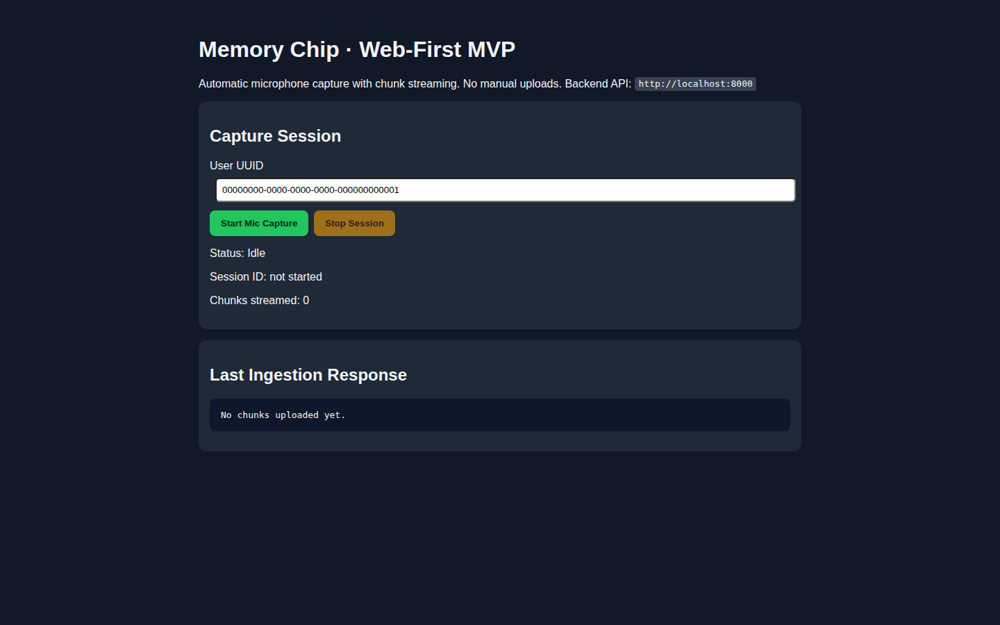

# memory-chip

Web-first MVP for automatic educational memory capture using the **phone microphone** as the capture device.

## Architecture overview

- **Frontend (`frontend/`)**: Next.js + TypeScript web app using `MediaRecorder` for automatic mic chunk capture and streaming.
- **Backend (`backend/`)**: FastAPI API with session management, chunk ingestion, and retrieval endpoints.
- **Async processing**: Celery worker (Redis broker) for transcription + downstream pipeline stages.
- **Database**: PostgreSQL for relational entities.
- **Vector DB**: Qdrant wiring for searchable memory endpoint.
- **Storage**: S3-compatible object storage (MinIO in local dev) for audio chunks.

This backend is intentionally structured so ingestion can later accept BLE/hardware chunk payloads without major refactor (same chunk/session contract).

## Monorepo layout

- `frontend/` — Next.js web app
- `backend/` — FastAPI app + Celery tasks + Alembic migrations
- `docker-compose.yml` — local infra (Postgres, Redis, Qdrant, MinIO)

## Core MVP features implemented

- Automatic mic capture from web phone browser (no manual upload flow)
- Session lifecycle APIs: create / end / status
- Chunk ingestion endpoint with object storage persistence
- Async pipeline with configurable transcription provider support:
  - OpenAI Whisper transcription
  - Deepgram provider scaffold (TODO)
  - Semantic educational filtering
  - Relevance scoring
  - Notes and summaries generation
  - Flashcard generation
- Core models + initial migration:
  - `users`, `sessions`, `audio_chunks`, `transcripts`, `notes`, `summaries`, `flashcards`, `embeddings`
- Minimal searchable memory endpoint wired to Qdrant client

## API endpoints

- `POST /api/sessions/create`
- `POST /api/sessions/{session_id}/end`
- `GET /api/sessions/{session_id}/status`
- `POST /api/ingest/chunk` (multipart with `audio` file + metadata)
- `GET /api/sessions/{session_id}/notes`
- `GET /api/sessions/{session_id}/summary`
- `GET /api/sessions/{session_id}/flashcards`
- `POST /api/search`

## Local development setup

### 1) Start infra

```bash
docker compose up -d
```

### 2) Backend

```bash
cd backend
python -m venv .venv
source .venv/bin/activate
pip install -r requirements.txt
cp .env.example .env
# add your OPENAI_API_KEY before starting the worker
alembic upgrade head
uvicorn app.main:app --reload --port 8000
```

Run Celery worker in another terminal:

```bash
cd backend
source .venv/bin/activate
celery -A worker.celery_app worker --loglevel=info
```

### 3) Frontend

```bash
cd frontend
cp .env.local.example .env.local
npm install
npm run dev
```

Open `http://localhost:3000` on your phone browser (same network) or desktop browser.

## UI preview



## Environment configuration

- Backend example vars: `backend/.env.example`
- Frontend example vars: `frontend/.env.local.example`

### Backend transcription settings

- `WHISPER_PROVIDER=openai_whisper` enables the OpenAI Whisper integration.
- `OPENAI_API_KEY` is required when `WHISPER_PROVIDER=openai_whisper`.
- `OPENAI_WHISPER_MODEL` defaults to `whisper-1`.
- `OPENAI_BASE_URL` is optional and can be used for proxies or testing.
- `WHISPER_PROVIDER=deepgram` is reserved for a future integration and currently returns a TODO-style transcription error placeholder instead of crashing the worker.

### Audio format note

The web client records chunks as `audio/webm;codecs=opus`. The backend stores those chunks as `.webm` and sends them to OpenAI Whisper as `audio/webm` on a best-effort basis. This works for the current MVP path, but if a proxy or upstream transcription provider rejects WebM/Opus input, the worker will store an error placeholder transcript with low confidence instead of failing the entire pipeline.

## Phased delivery plan

- **Phase 1 (this PR)**: Web-first MVP with phone mic capture, chunk streaming, async skeleton pipeline, and search wiring.
- **Phase 2**: Add downstream production LLM processing, Deepgram support, auth, and harden reliability/observability.
- **Phase 3**: Add hardware BLE ingest adapter to send chunks into the same backend ingestion interface.
